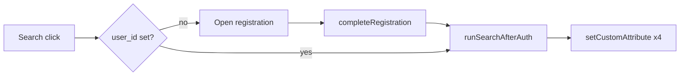

# Braze last-search custom attributes

## Context

- **Completion point:** A “completed” search in this app is when `[runSearchAfterAuth](src/app.js)` runs: it persists `booking_search`, logs `sia_searched_flight`, fetches results, saves `booking_last_results`, then navigates to search results. This is invoked from the Search button when `user_id` exists, and from the registration success path when `[pendingSearchPayload](src/app.js)` is resumed (~L431–434).
- **Braze API:** `[BrazeManager.setCustomAttribute(key, value)](src/managers/BrazeManager.js)` already calls `braze.getUser()?.setCustomUserAttribute?.(key, value)` with `string | number | boolean` values—appropriate for airport codes and ISO-style date strings from the booking payload.

## Implementation

**File:** `[src/app.js](src/app.js)` — inside `runSearchAfterAuth`, immediately after `StorageManager.set('booking_search', payload)` (and alongside the existing `logCustomEvent('sia_searched_flight', …)`), call:

| Attribute key                 | Value                      |
| ----------------------------- | -------------------------- |
| `sia_last_search_origin`      | `payload.origin_code`      |
| `sia_last_search_destination` | `payload.destination_code` |
| `sia_last_search_depart`      | `payload.depart_date`      |
| `sia_last_search_return`      | `payload.return_date`      |

Use `BrazeManager.setCustomAttribute(...)` for each.

**Optional (not required for correctness):** Call `braze.requestImmediateDataFlush` after the attributes so they sync promptly, mirroring `[completeRegistration](src/managers/BrazeManager.js)` (~L218). Today that flush is only inside `BrazeManager`; the minimal approach is to add a small `BrazeManager.requestImmediateDataFlush()` (or `flush()`) wrapper and invoke it once after the four attributes from `runSearchAfterAuth`, avoiding a direct `@braze/web-sdk` import in `app.js`.

## Out of scope

- **No** changes to `[bookingPayload.js](src/logic/bookingPayload.js)` unless you later want shared constants for attribute names.
- **No** README edits unless you explicitly want the new attributes documented alongside existing Braze tracking.
- The existing custom event property typo `orign_code` in `sia_searched_flight` is unrelated; fixing it would be a separate change.

## Verification

- Log in (or complete registration with a pending search), run a search, confirm in Braze (user profile or event/attribute stream) that the four custom attributes update to the submitted origin, destination, depart, and return values.

