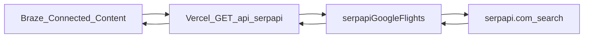

# Braze-friendly SerpAPI REST proxy

## Context

- **Current flow:** `[api/serpapi/flights.js](api/serpapi/flights.js)` validates with `[isValidBookingSearch](src/logic/bookingPayload.js)` (demo scope: origin **SIN**, destinations **NRT / LHR / SYD**), then calls `[fetchSqGoogleFlights](api/lib/serpapiGoogleFlights.js)`, which hardcodes `departure_id: DEMO_ORIGIN_CODE` and drops the raw SerpAPI `price_insights` block.
- **Client helper:** `[src/services/serpapiFlightsClient.js](src/services/serpapiFlightsClient.js)` is browser-only (`fetch('/api/serpapi/flights')`). Server routes should call `**api/lib/serpapiGoogleFlights.js`** directly; reuse `**mapItinerariesToResultRows`** (no `AppLogger` in that import chain) if you want parity with UI row shaping, or derive a **minimal flat “cheapest fare”** object from normalized itineraries in the handler.
- **Pricing trend:** SerpAPI documents `**price_insights`** on the same `engine=google_flights` response ([Price Insights](https://serpapi.com/google-flights-price-insights)): `lowest_price`, `price_level`, `typical_price_range`, `price_history` (array of `[unix_ts, price]`). There is no separate “price graph only” engine in SerpAPI today; a trend snapshot is tied to the **same search** (origin, destination, outbound/return dates) as the fares call.

## Proposed REST surface (Braze-oriented)

Use **GET** with query parameters so Connected Content URLs are easy to template. Mirror existing demo validation unless you explicitly widen scope later.

| Method | Path                         | Purpose                                                                                      |
| ------ | ---------------------------- | -------------------------------------------------------------------------------------------- |
| `GET`  | `/api/serpapi/fares`         | Latest **fares** for a round trip (cheapest option + metadata).                              |
| `GET`  | `/api/serpapi/pricing-trend` | Latest **price insights / trend** for the same route and dates (`price_insights` flattened). |

**Shared query parameters (both endpoints)**

| Param              | Required | Notes                                                                                            |
| ------------------ | -------- | ------------------------------------------------------------------------------------------------ |
| `origin_code`      | Yes      | IATA; must pass current demo rule (**SIN** only) unless you relax validation.                    |
| `destination_code` | Yes      | **NRT**, **LHR**, or **SYD** (per `isValidBookingSearch`).                                       |
| `depart_date`      | Yes      | `YYYY-MM-DD`                                                                                     |
| `return_date`      | Yes      | `YYYY-MM-DD`, on or after `depart_date`                                                          |
| `token`            | Optional | If added: must match env `CONNECTED_CONTENT_TOKEN` (or similar) to reduce public scraping abuse. |

**Error shape (consistent, flat):** `{ "ok": false, "error": "short_code", "message": "human readable" }` with appropriate HTTP status (400 validation, 503 missing `SERPAPI_API_KEY`, 502 SerpAPI failure).

---

### `GET /api/serpapi/fares` — expected output (flat)

Single object, scalars only (no nested arrays), easy for Liquid: `{{connected_content.cheap_price}}`.

Suggested fields:

| Field                     | Type    | Description                                                        |
| ------------------------- | ------- | ------------------------------------------------------------------ |
| `ok`                      | boolean | `true` on success                                                  |
| `origin_code`             | string  | Echo                                                               |
| `destination_code`        | string  | Echo                                                               |
| `depart_date`             | string  | Echo                                                               |
| `return_date`             | string  | Echo                                                               |
| `currency`                | string  | e.g. `SGD` (`[SERPAPI_CURRENCY](src/config/flightSearchScope.js)`) |
| `fetched_at`              | string  | ISO-8601 UTC                                                       |
| `itinerary_count`         | number  | Count after SQ filter                                              |
| `cheapest_price`          | number  | null                                                               |
| `cheapest_duration`       | string  | e.g. `7h 30m`                                                      |
| `cheapest_departure_time` | string  | Clock label                                                        |
| `cheapest_arrival_time`   | string  | Clock label                                                        |
| `cheapest_flight_numbers` | string  | e.g. `SQ12 / SQ11`                                                 |
| `cheapest_id`             | string  | Stable id from normalizer                                          |

If **no** SQ itineraries: `ok: true`, `itinerary_count: 0`, `cheapest_*` nulls (or omit `cheapest_*` — pick one convention and document).

---

### `GET /api/serpapi/pricing-trend` — expected output (flat)

Derived from SerpAPI’s `price_insights` when present:

| Field                                                                       | Type    | Description                                               |
| --------------------------------------------------------------------------- | ------- | --------------------------------------------------------- |
| `ok`                                                                        | boolean |                                                           |
| `origin_code`, `destination_code`, `depart_date`, `return_date`, `currency` | string  | Echo / config                                             |
| `fetched_at`                                                                | string  | ISO-8601                                                  |
| `insights_available`                                                        | boolean | `false` if Google/SerpAPI did not return `price_insights` |
| `lowest_price`                                                              | number  | null                                                      |
| `price_level`                                                               | string  | null                                                      |
| `typical_price_low`                                                         | number  | null                                                      |
| `typical_price_high`                                                        | number  | null                                                      |
| `price_history_length`                                                      | number  | `price_history.length`                                    |
| `price_history_latest_unix`                                                 | number  | null                                                      |
| `price_history_latest_price`                                                | number  | null                                                      |

**Optional (if you need history in Braze without nested JSON):** add a single string field `price_history_csv` like `unix:price;unix:price` capped to last N points to keep payload small — document the cap (e.g. 30).

---

## Implementation outline

1. **Extend `[fetchSqGoogleFlights](api/lib/serpapiGoogleFlights.js)`**
  - Add `origin_code` to the search object; set `departure_id` from it (replacing the hardcoded `DEMO_ORIGIN_CODE` in params).  
  - Return `**price_insights**` (pass-through or minimally normalized) from the parsed SerpAPI JSON alongside `itineraries`, so the trend route does not duplicate HTTP calls.
2. **Update `[api/serpapi/flights.js](api/serpapi/flights.js)`** (optional but recommended)
  - Pass `body.origin_code` into `fetchSqGoogleFlights` so POST behavior matches GET.
3. **Add `api/serpapi/fares.js` and `api/serpapi/pricing-trend.js`**
  - Parse `req.query`, build a minimal object compatible with `isValidBookingSearch` (reuse existing validation — may need a small helper that accepts query strings and sets fixed `trip_type`, `cabin_class`, `passengers` like the booking payload).  
  - Call shared lib; map to the flat shapes above.  
  - Same env guard as existing handler: missing `SERPAPI_API_KEY` → 503.
4. **Braze security**
  - Document optional `CONNECTED_CONTENT_TOKEN` (or reuse an existing secret pattern) for query authentication; return 401 when configured and token mismatches.
5. **Testing**
  - `vercel dev`: hit both GET routes with valid demo params; confirm `fares` matches cheapest from current POST `/api/serpapi/flights` and `pricing-trend` returns `insights_available` and fields when SerpAPI includes `price_insights`.

## Scope note

Keeping **demo allowlist** (SIN + three destinations) matches the current product and limits SerpAPI cost/abuse. If you need arbitrary IATA pairs, the plan changes to: relax `[isValidBookingSearch](src/logic/bookingPayload.js)` / add a server-only validator and document stricter rate limits + optional auth.