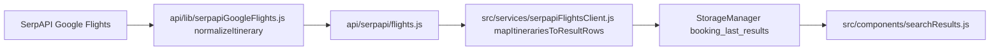

# Flight results: airport names, aircraft, layout

## Data flow

Round-trip responses use `**flights` for the outbound leg(s) only** (see [SerpAPI round-trip example](https://serpapi.com/google-flights-api)): one entry has `type: "Round trip"` but `flights` is e.g. a single LAX→AUS segment. So the existing **first leg / last leg** convention in `[normalizeItinerary](api/lib/serpapiGoogleFlights.js)` remains correct for outbound origin, outbound destination, dep/arr times, and total duration.

## 1. Server: enrich normalized itineraries

**File:** [api/lib/serpapiGoogleFlights.js](api/lib/serpapiGoogleFlights.js)

- From the first leg: `departure_airport?.name` → `originAirportName` (string).
- From the last leg: `arrival_airport?.name` → `destinationAirportName` (string).
- From all legs: collect `airplane` strings, **dedupe** (preserve order), join with `·` → `aircraft` (string, or empty if none).
- **Arrival day offset:** parse the date portion of `first.departure_airport.time` and `last.arrival_airport.time` (format `YYYY-MM-DD HH:mm` per SerpAPI docs). Compute calendar-day delta (UTC date strings are enough). Expose as `arrivalDayOffset` (non-negative integer). Reuse or add a small `extractDateKey(serpTime)` helper next to existing `extractClock`.

Update JSDoc on `normalizeItinerary` return type accordingly.

## 2. Client: map new fields onto result rows

**File:** [src/services/serpapiFlightsClient.js](src/services/serpapiFlightsClient.js)

- Extend `mapItinerariesToResultRows` JSDoc and return objects with:
  - `originAirportName`, `destinationAirportName`, `aircraft`, `arrivalDayOffset`
- Pass through from each itinerary; use `''` / `0` when missing.

No API route signature change beyond the richer `itineraries` objects already returned as JSON.

## 3. Mock data: same payload shape

**File:** [src/data/flights.js](src/data/flights.js)

- For each row in `FLIGHT_DATA`, add:
  - `**originAirportName`:** e.g. `Singapore Changi Airport` (consistent with `DEMO_ORIGIN_CODE` SIN).
  - `**destinationAirportName`:** realistic full names for NRT / LHR / SYD.
  - `**aircraft`:** plausible SQ-wide-body types per route.
  - `**arrivalDayOffset`:** `0` for same-calendar-day arrivals; `**1`** for the red-eye row (`23:55` → `08:00`) so the UI shows `(+1 day)` without needing Serp datetime strings in mocks.

## 4. UI: `searchResults.js` layout and styling

**File:** [src/components/searchResults.js](src/components/searchResults.js)

- Extend the flight row type in JSDoc to include the new optional fields (defaults in template: missing names → omit the bold header line; missing `aircraft` → omit or show em dash).
- **Route header (per card, left column):** If `originAirportName` and `destinationAirportName` exist, render **centered** (`text-center`) **bolder** (`font-bold`, appropriate size vs body) line: `Origin → Destination`.
- **Times row:** Single row with **equal styling** for departure and arrival (same `text-*`, `font-weight`, size—e.g. flex `justify-between` or grid `grid-cols-2` with `text-center` on each side). Append `**(+1 day)`** next to arrival when `arrivalDayOffset === 1`; for `> 1` use `**(+N days)`** (grammar-safe).
- **Duration:** Centered directly under the times row (`text-center`), unchanged semantic content (`f.duration`).
- **Last row:** Smaller / muted line with **flight code** and **aircraft**, e.g. `SQ308 · Airbus A350-900` (match existing tone with `text-sia-text-muted` and `text-xs`).

Keep the fare grid (right column) unchanged.

**Page-level summary:** [src/app.js](src/app.js) still passes `searchSummary` with IATA codes and dates; optional improvement—if the first flight has airport names, render them as the prominent centered line inside `renderSearchResults` and keep the existing `searchSummary` as a second, smaller centered subtitle (dates + codes). That satisfies “header origin and destination bolder and center aligned” using real names when available without new `app.js` 