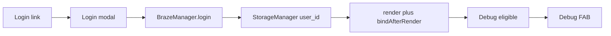

# Login overlay, Braze login, and debug launcher rules

## Current behavior (reference)

- Registration: `[registrationModal.js](src/components/registrationModal.js)` + Flowbite `Modal` in `[app.js](src/app.js)` (`getRegistrationModalInstance`, `openRegistrationModal`). Success path uses `BrazeManager.completeRegistration`, then `StorageManager.set('user_id', externalId)` where `externalId` is lowercased email (`[BrazeManager.js` L174–199](src/managers/BrazeManager.js)).
- Header Login: `[shell.js` L20](src/components/shell.js) is a `data-nav="utility"` link; `[app.js` L175–177](src/app.js) prevents default on all utility links with no other action.
- Debug: `[app.js` L66–73, L337–338](src/app.js) — `renderDebugOverlay()` is only injected when `?debug=true`; `bindDebugOverlay` no-ops otherwise. FAB starts with `hidden` and is revealed when debug mode is on.

## 1. Login modal component

Add `[src/components/loginModal.js](src/components/loginModal.js)` mirroring registration structure:

- Same outer Flowbite modal pattern as registration (`fixed`, `z-50`, `bg-white`, `border-sia-border`, header with title + close, form with `novalidate`).
- Fields: email only (`type="email"`, `autocomplete="username"`), inline error element, optional short helper copy (“Demo: sign in with your email as Braze user id”).
- Buttons: Cancel + Submit (same Tailwind classes as registration for visual parity).
- Export `renderLoginModal()`; reuse `isValidEmail` from `[registrationModal.js](src/components/registrationModal.js)` (import) to avoid duplication.

## 2. Wire header + app bootstrap

- In `[shell.js](src/components/shell.js)`: give the Login anchor a stable hook, e.g. `id="header-login-link"` or `data-open-login="true"` (keep `data-nav="utility"` if useful for styling).
- In `[app.js](src/app.js)`:
  - Import `renderLoginModal` and append it next to `renderRegistrationModal()` in the `render()` template.
  - Add `getLoginModalInstance` / `openLoginModal` / `closeLoginModal` (same Flowbite `new Modal(el, { backdrop: 'dynamic', closable: true })` pattern as registration; see comment at L106–108).
  - In `bindAfterRender`, after the generic utility `preventDefault` block, bind the login link: `preventDefault` + `openLoginModal()`.
  - `bindLoginForm()`: validate email with `isValidEmail`; normalize with `email.trim().toLowerCase()` (match registration external id).
  - On success: `BrazeManager.login(normalizedEmail)` (`[BrazeManager.js` L100–110](src/managers/BrazeManager.js)), `StorageManager.set('user_id', normalizedEmail)`, log via `AppLogger`, close modal, then `**render(); bindAfterRender()**` so the shell and debug chrome update without a full reload.

Optional polish (small, same file): after `login`, call `braze.getUser()?.setEmail?.(normalizedEmail)` if you want REST/SDK email parity with registration — not strictly required by `login()` today.

## 3. Debug overlay eligibility and persisted FAB visibility

Introduce a single helper in `app.js` (or tiny util) for clarity:

- `**isDebugOverlayEligible**`: `URLSearchParams(location.search).get('debug') === 'true'` **OR** `StorageManager.get('user_id')` is a non-empty string (same “logged in” signal as the search gate).
- `**render()`**: inject `renderDebugOverlay()` when `isDebugOverlayEligible` (not only URL flag).

**Persisted toggle (per your choice):**

- New `StorageManager` suffix e.g. `debug_launcher_hidden` (boolean, default `false`): when `true`, the floating `#debug-drawer-trigger` stays hidden even if eligible.
- `**?debug=true` override**: when the URL flag is set, always show the FAB (ignore `debug_launcher_hidden`) so developers are never stuck without the launcher.
- In `[debugOverlay.js](src/components/debugOverlay.js)` (or via `app.js` innerHTML patch): add a control inside the drawer, e.g. “Hide debug button” / “Show debug button”, that flips `debug_launcher_hidden` and updates the FAB + any recovery UI in the same tick (re-run a small `applyDebugLauncherVisibility()` from `bindDebugOverlay` or call `render()` if simpler — prefer targeted DOM toggle to avoid wiping main view state when only hiding FAB).

**Recovery when FAB is hidden:** add a discrete utility-bar control visible only when `isDebugOverlayEligible && debug_launcher_hidden && !urlDebug`, e.g. a text button “Debug” next to Login in `[shell.js](src/components/shell.js)`, driven by a parameter on `renderShellHeader`, e.g. `renderShellHeader({ activeView, showDebugRecovery: boolean })`. Clicking it clears `debug_launcher_hidden` (or sets it false) and shows the FAB again.

## 4. `bindDebugOverlay` changes

- Guard with `**isDebugOverlayEligible`** instead of only the URL param.
- On bind: subscribe/unsubscribe `EVENT_LOGGED` as today; wire drawer open/close and refresh.
- Apply FAB visibility: show trigger when eligible and (`!debug_launcher_hidden` OR `urlDebug`); hide when not eligible.
- Wire the new drawer toggle and header recovery link to the same visibility helper.

## 5. Edge cases

- **Already logged in:** opening Login again can still be allowed (re-identify same email) or you can no-op / show message — simplest is allow submit and call `login` + `set user_id` again (idempotent).
- `**syncUserFromStorage`** in `[bootstrapApp](src/app.js)` already runs on load; persisted `user_id` after login keeps Braze aligned on refresh without extra work.

## Files to touch

| File                                                               | Change                                                                                          |
| ------------------------------------------------------------------ | ----------------------------------------------------------------------------------------------- |
| `[src/components/loginModal.js](src/components/loginModal.js)`     | **New** — modal markup                                                                          |
| `[src/components/shell.js](src/components/shell.js)`               | Login hook + optional `showDebugRecovery` block                                                 |
| `[src/components/debugOverlay.js](src/components/debugOverlay.js)` | Toggle control in drawer UI                                                                     |
| `[src/app.js](src/app.js)`                                         | Mount modal, login bindings, debug eligibility, FAB/recovery logic, refactor `bindDebugOverlay` |

No README edits unless you explicitly want documentation updated later.