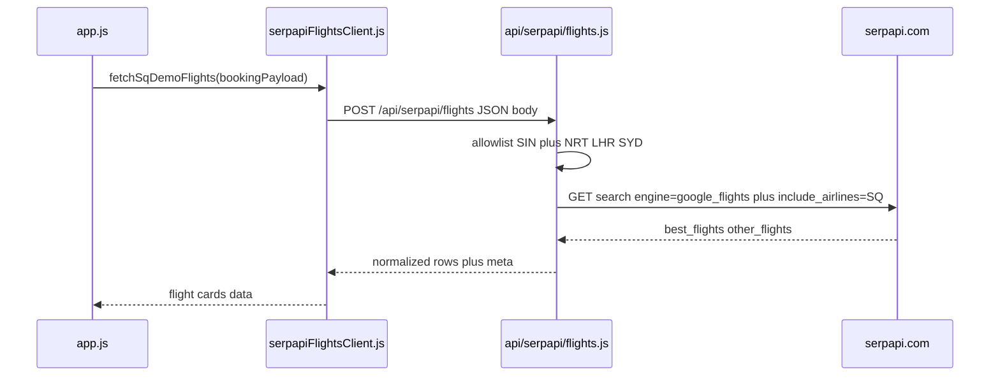

# SerpAPI Google Flights module (SQ + demo routes)

## Context

- SerpAPI Google Flights uses `GET https://serpapi.com/search` with `engine=google_flights` ([docs](https://serpapi.com/google-flights-api)). relevant params: `departure_id`, `arrival_id`, `outbound_date`, `return_date`, `type=1` (round trip), `travel_class=1` (Economy), `adults=1`, `**include_airlines=SQ**` (cannot be combined with `exclude_airlines`). Localization: e.g. `hl=en`, `gl=sg`, `**currency=SGD**` to align with the results UI which labels prices as S$ (`[searchResults.js](src/components/searchResults.js)`).
- Demo scope already enforced in `[bookingPayload.js](src/logic/bookingPayload.js)`: `origin_code === 'SIN'`, `destination_code ∈ {NRT,LHR,SYD}`.
- **Secrets:** Follow the same pattern as Braze REST in `[.env.example](.env.example)`: add `**SERPAPI_API_KEY`** (or `SERPAPI_KEY`—pick one name and use it consistently) as **server-only** (Vercel env / local `.env`, never `VITE_`*). The browser must call only your `/api/...` proxy, not SerpAPI directly.
- **Why a proxy:** A client-side module cannot safely hold the SerpAPI key; `[vite.config.js](vite.config.js)` already proxies `/api` to `vercel dev` on port 3000 for local use.

## Architecture

## Files to add or change

| Piece                                                                                         | Purpose                                                                                                                                                                                                                                                                                                                                                                                                                                                                                                                                                                                                                                                                                                                                                                        |
| --------------------------------------------------------------------------------------------- | ------------------------------------------------------------------------------------------------------------------------------------------------------------------------------------------------------------------------------------------------------------------------------------------------------------------------------------------------------------------------------------------------------------------------------------------------------------------------------------------------------------------------------------------------------------------------------------------------------------------------------------------------------------------------------------------------------------------------------------------------------------------------------ |
| `[.env.example](.env.example)`                                                                | Document `SERPAPI_API_KEY=` (server-only) and one-line reminder to set it in Vercel.                                                                                                                                                                                                                                                                                                                                                                                                                                                                                                                                                                                                                                                                                           |
| `**api/lib/serpapiGoogleFlights.js**` (new)                                                   | Build query params, call `fetch` to SerpAPI, merge `best_flights` + `other_flights`, **post-filter** itineraries where every leg’s `airline` is Singapore Airlines (defense in depth; codeshare edge cases). Map each option to a small normalized object: `price`, `currency`, `totalDuration`, first/last leg times, concatenated SQ `flight_number`s, etc. JSDoc on exported functions per project documentation rules.                                                                                                                                                                                                                                                                                                                                                     |
| `**api/serpapi/flights.js`** (new)                                                            | Vercel handler: `POST`-only (or `GET` with tight query—prefer `POST` for bodies). Read `process.env.SERPAPI_API_KEY`; if missing, return **503** (mirror `[api/braze/user-data.js](api/braze/user-data.js)`). Validate body with the same allowlist as `[isValidBookingSearch](src/logic/bookingPayload.js)` (reuse `isValidBookingSearch` via import from `[src/logic/bookingPayload.js](src/logic/bookingPayload.js)` if the Vercel bundle resolves cleanly; otherwise duplicate the minimal code array check to avoid pulling fragile paths). Reject any origin ≠ `SIN` or destination outside `NRT/LHR/SYD` with **400**. On SerpAPI error / non-OK, return **502** with truncated detail, log via concise `console.error` or existing patterns (no full API key in logs). |
| `**src/config/flightSearchScope.js`** (new, optional but matches “configuration file” intent) | Export non-secret constants: `DEMO_ORIGIN_CODE`, `DEMO_DESTINATION_CODES`, `SINGAPORE_AIRLINES_IATA = 'SQ'`, and default SerpAPI localization `SERPAPI_HL`, `SERPAPI_GL`, `SERPAPI_CURRENCY` so both server helper and client share one source of truth. **Do not** put the API key here.                                                                                                                                                                                                                                                                                                                                                                                                                                                                                      |
| `**src/services/serpapiFlightsClient.js`** (new)                                              | `fetch('/api/serpapi/flights', { method: 'POST', ... })` + JSON parse; map response into the **existing** results row shape expected by `[searchResults.js](src/components/searchResults.js)`: `{ id, flightNumber, departureTime, arrivalTime, duration, prices }` where `prices` is length 4. **Mapping:** SerpAPI returns one total **round-trip** price per itinerary; place it in the **Value** index (`1`) and use `null` for Lite / Standard / Flexi unless you later add multiple SerpAPI calls per fare class. Format times/duration consistently (strings as today’s mock). Use `AppLogger` for success/failure from the UI side.                                                                                                                                    |

## Wiring search (recommended)

- Update `[runSearchAfterAuth](src/app.js)` (~L199): after registration gate, call the new client module. If the proxy returns rows, `StorageManager.set('booking_last_results', rows)`; if the proxy fails or returns empty, **fall back** to `FLIGHT_DATA[payload.destination_code]` so the demo still works without a key or when SerpAPI is down.
- Keep the existing ~1.5s loading state only if you still want simulatedlatency; otherwise replace with real await (or minimum spinner timefor UX).

## Testing checklist

- With no `SERPAPI_API_KEY`: app still shows mock results (fallback).
- With key + `vercel dev`: `POST /api/serpapi/flights` with a valid `booking_search`-shaped body returns only SQ-scoped routes for SIN→NRT/LHR/SYD.
- Invalid destination (e.g. `JFK`) returns 400 without calling SerpAPI.

## Out of scope / follow-ups

- **True four-bucket pricing** would require multiple SerpAPI queries (varying `travel_class` or fare filters) or a different data source; the plan above preserves the UI contract with Value-only live data.
- `**deep_search=true`**: optional later flag for heavier, more browser-identical results ([docs](https://serpapi.com/google-flights-api#api-parameters-advanced-google-flights-parameters-deep-search)).

