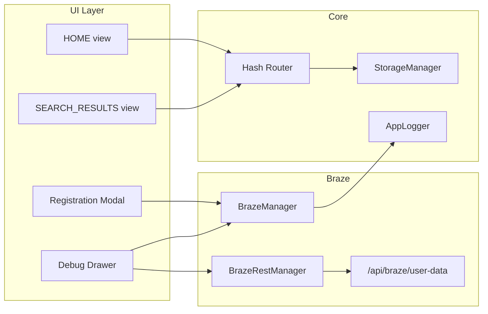

# SIA Demo Booking Website — Build Plan

## Context

The workspace currently contains **only** design and rules under `.cursor/`—no application source. This plan assumes creating the full app at the workspace root (or a `src/` tree under it), then **initializing a new Git repository** and **hosting production on Vercel**, per [devops](.cursor/rules/utilties/devops.mdc).

## 0. Repository and hosting bootstrap

**Git (new repo)**

- Run `git init` in the project root; use `**main`** as the default branch ([devops](.cursor/rules/utilties/devops.mdc)).
- Add a **robust `.gitignore`** before the first commit: `node_modules/`, build output (`dist/`), `.env` and local env files, OS/editor junk, and anything that could leak keys or LocalStorage-like dumps.
- **Conventional Commits** for all commits: `type(scope): description` (e.g. `feat(ui): add booking widget`, `chore(vercel): add serverless braze proxy`).
- **Branching:** day-to-day work on `feature/`* or `fix/`*; merge to `main` when production-ready.
- **Remote:** Create a **new empty repository** under the target GitHub profile **[auzaniridzwan-oss](https://github.com/auzaniridzwan-oss)**, then `git remote add origin <repo-url>` and push `main`. (If the workspace lives inside Google Drive, consider cloning the new repo to a local non-synced path for day-to-day dev to avoid sync/git friction—optional but often recommended.)

**Vercel**

- In the **[auzani-ridzwans-projects](https://vercel.com/auzani-ridzwans-projects)** Vercel team/account, **Import** the new GitHub repo.
- **Framework preset:** Vite; **build command** `npm run build` (or equivalent); **output** `dist` (Vite default).
- **Environment variables** (names illustrative—align with `.env.example` during implementation):
  - **Client / build:** e.g. `VITE_BRAZE_SDK_KEY`, `VITE_BRAZE_SDK_URL` (or project’s chosen `import.meta.env` names for Web SDK only—never REST keys in the browser).
  - **Serverless only:** `BRAZE_REST_API_KEY`, `BRAZE_REST_API_URL` for `/api/braze/user-data` ([brazeREST.mdc](.cursor/rules/braze/brazeREST.mdc)).
- Redeploy after env changes; confirm preview deployments on PRs if enabled.

**README:** Document clone URL, `npm install` / `npm run dev`, required env vars for local dev vs Vercel, and the deployment URL once the project is linked.

## Architecture (high level)




## 1. Tooling and scaffold

- **Bundler:** [Vite](https://vitejs.dev/) (vanilla JS + ES modules) for fast dev and a clean split of managers/views/components.
- **CSS:** [Tailwind CSS](https://tailwindcss.com/) v4 or v3 + [Flowbite](https://flowbite.com/) (per [layout.mdc](.cursor/rules/ui/layout.mdc)): tabs, datepicker, dropdowns, modal, drawer for debug.
- **Extend Tailwind theme** with tokens from [sia_web.json](.cursor/design/sia_web.json) `design_system.colors` (`primary_navy`, `accent_gold`, `section_tan`, etc.) so components use semantic classes where possible; keep sharp corners (`rounded-sm` / `rounded-none`) for the SIA look.
- **Fonts:** Body stack `Proxima Nova, Arial, sans-serif` (note: Proxima is often licensed—use **fallback to system Arial** or load a free alternative if no license; headings: **Playfair Display** or similar via Google Fonts to match “serif-style for titles”).
- **Icons:** FontAwesome kit in `[index.html](https://kit.fontawesome.com/a21f98a3f6.js)` with `crossorigin="anonymous"`, `defer`/`async` per [iconography.mdc](.cursor/rules/ui/iconography.mdc).
- **Runtime helper:** `dayjs` for date validation (depart ≤ return) per [bookingdemo.mdc](.cursor/rules/logic/bookingdemo.mdc).
- **Deliverables:** `package.json`, `vite.config.js`, Tailwind config, `index.html` entry, `.gitignore` (node_modules, `.env`*), `.env.example` for Braze-related vars.

## 2. Core singletons (rules-aligned)


| Module             | Responsibility                                                                                                                                                                                                                                                                                                                                                                                     |
| ------------------ | -------------------------------------------------------------------------------------------------------------------------------------------------------------------------------------------------------------------------------------------------------------------------------------------------------------------------------------------------------------------------------------------------- |
| `StorageManager`   | Prefix `ar_app`_, suffix-only API; keys `booking_search`, `booking_last_results`, `user_id`, `theme_mode` / `debug`-related if needed ([localstorage.mdc](.cursor/rules/utilties/localstorage.mdc)).                                                                                                                                                                                               |
| `AppLogger`        | Ring buffer, styled stdout, `getLogs()`, categories; **no PII**; on `ERROR`, optional `App_Error` via Braze wrapper ([logging.mdc](.cursor/rules/utilties/logging.mdc)).                                                                                                                                                                                                                           |
| `BrazeManager`     | Singleton: `initialize`, `login` / `changeUser` + `openSession`, `setCustomAttribute`, `logCustomEvent` with try/catch, `subscribe(eventType, callback)` returning `unsubscribe`, notify on `EVENT_LOGGED`; optional IAM/content card hooks per [braze.mdc](.cursor/rules/braze/braze.mdc). Load official Web SDK script from Braze CDN; API key from `import.meta.env` or build-time replacement. |
| `BrazeRestManager` | `fetchUserProfile(externalId)` → GET `/api/braze/user-data?id=...`, short TTL cache (~30s), error mapping per [brazeREST.mdc](.cursor/rules/braze/brazeREST.mdc).                                                                                                                                                                                                                                  |


## 3. Routing and views

- **Hash routes:** `/#/home`, `/#/search-results` ([navigation.mdc](.cursor/rules/logic/navigation.mdc)).
- **Behavior:** Intercept internal nav clicks; on view change set `location.hash`, scroll to `(0,0)`, call `BrazeManager.logCustomEvent('page_view', { page: currentView })`.
- **State:** `booking_search` and results **only** from `StorageManager`—never from URL query/hash params for search fields.
- **Refresh / deep link:** On load, parse hash for view; if `booking_search` invalid/missing on results route, redirect or show empty state per booking rules (avoid silent null failures).

**Views to implement (MVP aligned to design JSON pages):**

- **HOME:** Dual-level header ([layout.mdc](.cursor/rules/ui/layout.mdc)), hero with image + dynamic promo title (static default; expose `updateHeroBanner` / subscribe via `BrazeManager` for future IAM/content), overlay **booking widget** with Flowbite tabs: Book Trip (functional), Manage Booking / Check In / Flight Status (placeholder or disabled tabs matching [sia_web.json](.cursor/design/sia_web.json)), multi-column decorative footer.
- **SEARCH_RESULTS:** Stepper (Flights active = step 1), list of **flight cards** matching design: left column times/duration/flight number; right **fare grid** Lite / Value / Standard / Flexi with gold prices and sold-out styling when `prices[i] === null` ([bookingdemo.mdc](.cursor/rules/logic/bookingdemo.mdc)).

**Optional later:** `BOOKING_FLOW` (passengers / review / payment) is marked optional in navigation rules—out of scope for MVP unless you expand scope after MVP.

## 4. Booking logic and data

- **Source of truth:** Inline constant `FLIGHT_DATA` (or import generated from) `demo_data.flights` in [sia_web.json](.cursor/design/sia_web.json)—keys `NRT`, `LHR`, `SYD`; each row keeps `id`, `flightNumber`, times, `duration`, `prices` length-4.
- **Widget fields:** Read-only origin Singapore (SIN); destination select limited to three cities; trip type radio (Book vs Redeem); dual date selection (range or depart/return) with validation; class + passengers **display-only** “Economy”, “1 Adult” ([bookingdemo.mdc](.cursor/rules/logic/bookingdemo.mdc)).
- `**handleSearch`:** If validation fails → empty/error state; if valid → **registration gate** (below) → then `StorageManager.set('booking_search', payload)` → simulated **1.5s** loading → filter `FLIGHT_DATA[destination_code]` → optionally `StorageManager.set('booking_last_results', snapshot)` → navigate to `/#/search-results`. Log a non-PII custom event e.g. `flight_search` with destination code and dates only.

## 5. Registration gate ([registration.mdc](.cursor/rules/logic/registration.mdc))

- If `StorageManager.get('user_id')` is missing/blank, **Search** opens Flowbite **modal** (accessible labels, validation messages); store **pending search** in memory only.
- On submit: validate first/last name, email, optional SG phone `+65` + 8 digits; implement `BrazeManager.completeRegistration(profile)` (or equivalent): `changeUser` + `openSession`, `setEmail` / `setFirstName` / `setLastName` / `setPhoneNumber` if present, custom attrs (`registration_completed_at`, `registration_source`), event `Registration - Completed` with `has_phone` only, `requestImmediateDataFlush`, then `StorageManager.set('user_id', externalId)` (e.g. normalized email—document in README).
- On success: close modal, **resume** search: persist `booking_search`, run loading + navigation per navigation §5.
- **AppLogger:** `[AUTH]` / `[UI]` lines without PII.

## 6. Debug overlay ([debugoverlay.mdc](.cursor/rules/ui/debugoverlay.mdc))

- Shown only when `location.search` includes `debug=true` (hash can still change views).
- Flowbite **Drawer** (left): JSON `<pre>` panels; subscribe `BrazeManager.subscribe('EVENT_LOGGED', …)` with cleanup; prepend events with brief gold highlight; on open call `BrazeRestManager.fetchUserProfile(StorageManager.get('user_id'))` for server-side profile truth.

## 7. Vercel serverless proxy ([brazeREST.mdc](.cursor/rules/braze/brazeREST.mdc))

- Add `api/braze/user-data` (or Vercel `api/` convention for your chosen structure): server-only `BRAZE_REST_API_KEY`, `BRAZE_REST_API_URL`; forward `users/export/ids` with `external_ids`; validate request includes `external_id` (from query); return JSON errors for 4xx/5xx/429.

## 8. Polishing and quality

- **Responsive:** Booking grid stacks on mobile; primary CTA full width on small screens ([layout.mdc](.cursor/rules/ui/layout.mdc)).
- **JSDoc:** Public functions documented per [documentation.mdc](.cursor/rules/utilties/documentation.mdc).
- **README.md:** Per [readme.mdc](.cursor/rules/utilties/readme.mdc): overview, stack (HTML/CSS/Flowbite, FA kit, Braze, Vercel), setup, architecture (StorageManager, AppLogger), SPA hash + storage-only search params, list of custom events/attributes, link to [Braze Web docs](https://www.braze.com/docs/developer_guide/sdk_integration/?sdktab=web).
- **CI (optional):** If adding `.github/workflows`, include lint for JS/CSS per devops rule.

## 9. Risk / dependency notes

- **Braze Web SDK** requires real `apiKey` and endpoint in env for production behavior; without keys, managers should degrade gracefully (try/catch, no crash).
- **Proxima Nova** may need a licensed webfont or substitution—plan documents the fallback strategy in README.

## Suggested file layout (after implementation)

```
siaweb/
  index.html
  package.json
  vite.config.js
  tailwind.config.js (or postcss)
  .env.example
  api/braze/user-data.js    # Vercel serverless
  src/
    main.js                 # bootstrap + router
    data/flights.js         # FLIGHT_DATA from design JSON
    managers/
      StorageManager.js
      AppLogger.js
      BrazeManager.js
      BrazeRestManager  .js
    components/
      shell/Header.js Footer.js
      home/HeroBooking.js
      results/FlightResults.js Stepper.js
      auth/RegistrationModal.js
      debug/DebugOverlay.js
    styles/main.css
```

## Implementation order

1. Scaffold Vite + Tailwind + Flowbite + fonts + FA kit + Braze script tag.
2. Implement StorageManager, AppLogger, theme tokens.
3. Build layout shell (header, footer), hero placeholder, static footer links.
4. Implement hash router + view containers + Braze `page_view` on route change.
5. Booking widget + validation + `handleSearch` + mock delay + results view + fare grid.
6. BrazeManager + env wiring + registration modal + resume search.
7. Braze REST API route + BrazeRestManager + debug drawer.
8. README, `.env.example`, `.gitignore`, optional CI.

